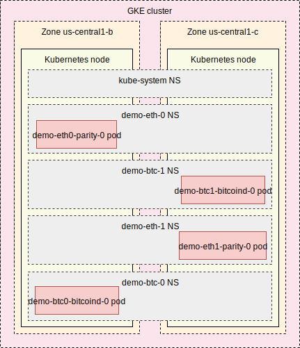

Howto deploy full env from scratch. We assume new `demo` env in this manual. 

## Client Software Requirements:
* MacOS or Linux. Windows supports all the tools but is out of scope of this manual
* git
* [terraform](https://www.terraform.io/downloads.html) 0.12
* [terragrunt](https://github.com/gruntwork-io/terragrunt#install-terragrunt)
* [gcloud](https://cloud.google.com/sdk/install) 
* kubectl (version from gcloud is ok)
* [helm](https://helm.sh/docs/using_helm/#installing-helm), version 2.x, version 3 isn't supported now. Check `helm version -c`
* [helmfile](https://github.com/roboll/helmfile#installation) 
* [helm-gcs](https://github.com/hayorov/helm-gcs#installation) plugin
* Please follow "Before you begin" part of [GCP manual](https://cloud.google.com/kubernetes-engine/docs/how-to/iam) (gcloud configuration)

## Top-level road-map: 
* create GCP project, configure gcloud to this project
* clone this repo, configure terraform state storage, create/adjust terragrunt manifests
* provision GCP services and GKE via terragrunt
* provision basic in-k8s such as helm via terragrunt
* deploy cryptonodes via helmfile
* check logs
* (*optional*) troubleshooting, remove & re-deploy, ops tasks
* teardown

## Let's dive in:
### Create project
and configure gcloud to use this project by default. Specify real project ID you are going to create instead of `ENTER_YOUR_PROJECT_ID_HERE` :
 
```bash
export GCP_PROJECT_ID=ENTER_YOUR_PROJECT_ID_HERE
gcloud projects create $GCP_PROJECT_ID --set-as-default
```
Add billing to this project. You may use web console to do so, here is cli version to connect new project to first open billing account
```bash
gcloud beta billing accounts list --filter=open=true  --format='get(name)' | xargs -I'{}' gcloud beta billing projects link $GCP_PROJECT_ID --billing-account '{}'
```
Allow terraform and other apps to work via gcloud sdk, if not done before
```bash
gcloud auth application-default login
```
### Clone this repo
```bash
git clone https://github.com/blockchain-etl/blockchain-terraform-deployment 
cd blockchain-terraform-deployment
export PROJECT_ROOT=$(pwd)
```
We'll reference to this directory as `<project-root>` below. This manual also assumes you do not change directory on your own. All the work should be performed on the same terminal.

* Configure/check remote terraform state storage. We use [remote terraform state storage](https://www.terraform.io/docs/state/remote.html),
 namely [gcs backend](https://www.terraform.io/docs/backends/types/gcs.html). You need an access to storage bucket. 
 In this manual we'll use bucket created in the same project, but keep in mind - it's better to store terraform state out of terraform-controlled project.
 Run this code to create GCS bucket ( we use `us-central1` bucket location here, change it to region where you're going to deploy infrastructure ):
    ```bash
    export TF_STATE_BUCKET=${GCP_PROJECT_ID}-tf
    gsutil mb -p ${GCP_PROJECT_ID} -c standard -l us-central1 gs://${TF_STATE_BUCKET}
    gsutil versioning set on gs://${TF_STATE_BUCKET}
    ```  
    and configure terraform to use it:
    ```bash
    sed -i "" -e "s/bucket-to-store-tf-state/$TF_STATE_BUCKET/g" infra/live/terragrunt.hcl  
    cat infra/live/terragrunt.hcl 
    ```  
    If you want to use another storage - adjust `<project-root>/infra/live/terragrunt.hcl` accordingly and ensure you have full access to this storage.
* Create/adjust terragrunt manifests
    ```bash
    cd "$PROJECT_ROOT/infra/live"
    mkdir demo demo/in-k8s demo/infra
    cp staging/in-k8s/terragrunt.hcl demo/in-k8s/
    cp staging/infra/terragrunt.hcl demo/infra/
    ```
    Perform following replacements(see automated replacement below):
    `your-staging-project` with project name `your-project-here` in both `.hcl` files
    `staging` with `demo` in `demo/infra/terragrunt.hcl`
    Here are `sed` commands to perform replacement :
    ```bash
    cd "$PROJECT_ROOT/infra/live/demo"
    sed -i "" -e "s/your-staging-project/$GCP_PROJECT_ID/g" in-k8s/terragrunt.hcl infra/terragrunt.hcl
    sed -i "" -e 's/staging/demo/g' infra/terragrunt.hcl
    ```

### Provision GCP services and GKE cluster
Review inputs in `<project-root>/infra/live/demo/infra/terragrunt.hcl` and adjust as needed. 

Pay attention to regions, zones, machine type. 
You need to adjust `GKE_MASTER_AUTHORIZED_NETWORKS` with your IP address ranges to additionally restrict GKE master API access by IP whitelist. 
Use `0.0.0.0/0` to effectively allow connection to GKE master API from any IP on network level. Access is still restricted by Google auth.
 
Ensure you get GCP credentials earlier via `gcloud auth application-default login` and continue : 
 ```bash
cd "$PROJECT_ROOT/infra/live/demo/infra"
terragrunt plan
 ```
Review resources to create and proceed when everything looks fine. It usually takes 10-30min
```bash
terragrunt apply -auto-approve
```
Check deployed cluster connectivity via
```bash
kubectl cluster-info
```
You should not get any errors
### Deploy basic in-k8s services
```bash
cd "$PROJECT_ROOT/infra/live/demo/in-k8s"
terragrunt plan
```
Review resources to create and proceed when everything looks fine. It should finish up in seconds.
```bash
terragrunt apply -auto-approve
```

### Deploy cryptonodes via helmfile
```bash
cd "$PROJECT_ROOT/deploy/chains"
mkdir -p demo # should be created by terraform earlier
cp staging/helmfile.yaml demo/helmfile.yaml
```
Replace release names in `helmfile.yaml` via 
```bash
# cd "$PROJECT_ROOT/deploy/chains" # should be there already
sed -i "" -e 's/staging/demo/g' demo/helmfile.yaml
``` 
We also add disk limit into all nodes, as default project SSD quota is low. This action **isn't required** in GCP projects with increased SSD disk limits.

**Note:** due to the size of public blockchains, 50Gi may quickly fill to capacity within 2-3 hours.
We advise reading up on current [Bitcoin and Ethereum chain sizes](https://github.com/blockchain-etl/blockchain-kubernetes/blob/dev/resources.md) and setting a more appropriate value. 
50GB limit is used to pass project's default quotas only.
 
Run shell snippet to add disk limit to all required files:
```bash
cd "$PROJECT_ROOT/deploy/chains/demo"
for FILENAME in values-*.yaml;do \
[[ $FILENAME =~ custom.yaml$ ]] && continue ; \
CUSTOM_FILENAME=$(basename $FILENAME .yaml)-custom.yaml ; \ 
cat << 'EOF' >> $CUSTOM_FILENAME
persistence:
  size: "50Gi"
EOF
done
``` 
You may override cryptonode image name or version, add some blockchain bootnodes in `$PROJECT_ROOT/deploy/chains/demo/values-*-custom.yaml` files per every cryptonode deploy, 
you may also add common values to `$PROJECT_ROOT/deploy/chains/common/values-*.yaml`. Do not use `$PROJECT_ROOT/deploy/chains/demo/values-*.yaml` 
without `-custom.yaml`, as these files are generated by terraform and may be overwritten by terragrunt executions (it doesn't happen in this manual).
     
Use shell snippet to adjust `<project-root>/deploy/chains/helmfile.yaml` for new `demo` env:
```bash
cd "$PROJECT_ROOT/deploy/chains"
sed -i "" -e 's/replaceme/demo/g' helmfile.yaml
```

Now we're ready to deploy cryptonodes.

Helm will use public GCS bucket `gs://blockchain-k8s/charts` as helm repository to pull latest cryptonodes helm charts.
#### Actual deploy
Check helm release status to confirm nothing is deployed; running this command should return several errors, similar to `“err 0: release "demo-eth-1" failed: helm exited with status 1` :
```bash
cd "$PROJECT_ROOT/deploy/chains"
export KUBE_CONTEXT=$GCP_PROJECT_ID-baas0
helmfile -e demo status # run this to confirm an empty installation; this command should return several errors as nothing is deployed yet
```
Each command may take a couple minutes to complete.
* Option 1: deploy individual cryptonodes one-by-one for each chain. 
    Run all four `helmfile` commands to have separate redundant nodes for a total of (2) bitcoin nodes and (2) ethereum nodes.
    We start from 2 bitcoin cryptonodes
    ```bash
    cd "$PROJECT_ROOT/deploy/chains"
    helmfile -e demo -l name=demo-btc-0 sync 
    helmfile -e demo -l name=demo-btc-1 sync
    ```
    and then deploy 2 ethereum cryptonodes
    ```bash
    cd "$PROJECT_ROOT/deploy/chains"
    helmfile -e demo -l name=demo-eth-0 sync
    helmfile -e demo -l name=demo-eth-1 sync
    ```
* Option 2: parallel deploy, deploy multiple ( 2 in our case ) nodes of the same blockchain at once. 
    These commands spawn two separate bitcoin(`chain=btc`) and ethereum (`chain=eth`) nodes. 
    Run both `helmfile` commands to have a total of (2) bitcoin nodes and (2) ethereum nodes
    ```bash
    cd "$PROJECT_ROOT/deploy/chains"
    helmfile -e demo -l chain=btc sync
    helmfile -e demo -l chain=eth sync
    ```
(*Optional*) It may take some time and even fail in case of helm overload, some wrong values, project quotas.
In this case you should find the source of the issue, correct it and start again. 
Some starting points are `kubectl get` and `kubectl describe` to pods, services, PVCs.
You may require helm invocations to remove failed releases, for example (remove comment to run)
```bash
#helm --kube-context $KUBE_CONTEXT delete --purge demo-btc-0
#helm --kube-context $KUBE_CONTEXT delete --purge demo-btc-1
#helm --kube-context $KUBE_CONTEXT delete --purge demo-eth-0
#helm --kube-context $KUBE_CONTEXT delete --purge demo-eth-1
```
and then re-run "helmfile ... sync" commands from above. Sometimes you may require persistent volumes removal, as helm chart keeps volumes. 
You can delete *all* volumes *with data loss* using following command:
```bash
#ku6ectl --context $KUBE_CONTEXT delete pvc -l app.kubernetes.io/instance=demo-btc-0 -A
#ku6ectl --context $KUBE_CONTEXT delete pvc -l app.kubernetes.io/instance=demo-btc-1 -A
#ku6ectl --context $KUBE_CONTEXT delete pvc -l app.kubernetes.io/instance=demo-eth-0 -A
#ku6ectl --context $KUBE_CONTEXT delete pvc -l app.kubernetes.io/instance=demo-eth-1 -A
``` 
Remove `#` comment and replace `6` with `b` when you really need to remove all the persistent volumes and data.


We should get namespaces and pods as shown on the diagram [](./images/k8s-NS.svg)

### Check our cryptonodes
```bash
kubectl --context $KUBE_CONTEXT -n demo-eth-0 get pod,svc
kubectl --context $KUBE_CONTEXT -n demo-eth-1 get pod,svc
kubectl --context $KUBE_CONTEXT -n demo-btc-0 get pod,svc
kubectl --context $KUBE_CONTEXT -n demo-btc-1 get pod,svc
```
Check logs
```bash
kubectl --context $KUBE_CONTEXT -n demo-eth-0 logs --since=15s --tail=10 demo-eth-0-parity-0
kubectl --context $KUBE_CONTEXT -n demo-eth-1 logs --since=15s --tail=10 demo-eth-1-parity-0 
kubectl --context $KUBE_CONTEXT -n demo-btc-0 logs --since=15s --tail=10 demo-btc-0-bitcoind-0
kubectl --context $KUBE_CONTEXT -n demo-btc-1 logs --since=15s --tail=10 demo-btc-1-bitcoind-0
```
In case you don't see the logs - it may be something wrong with cryptonode, and you should investigate it.

Check CPU & memory usage by pods
```bash
kubectl --context $KUBE_CONTEXT top pod -A
```
### Troubleshooting, remove & re-deploy, ops tasks
Check [this manual](ops.md) for various operations, such as single cryptonode deploy, basic changes, troubleshooting etc.

### Teardown
* Remove helm releases with:
```bash
cd "$PROJECT_ROOT/deploy/chains"
helmfile -e demo destroy
```
* remove persistent volumes, this removes *all* the data effectively(blockchain data loss happens here)
```bash
kubectl --context $KUBE_CONTEXT delete pvc -l app.kubernetes.io/name=bitcoind -A
kubectl --context $KUBE_CONTEXT delete pvc -l app.kubernetes.io/name=parity -A 
```
* teardown infrastructure via terragrunt, it takes 10-30 minutes
```bash
cd "$PROJECT_ROOT/infra/live/demo/infra/"
terragrunt destroy
```
Answer `yes` after reviewing all the resources terraform is going to delete. It takes a couple minutes.
In case you hit VPC destroy error such as 
```bash
Error: Error waiting for Deleting Network: The network resource 'projects/your-project-here/global/networks/baas0' is already being used by 'projects/your-project-here/global/firewalls/k8s-fw-ad83ceb911d9211eaa09042010a80018'
```
You need to remove firewall rules via following snippet (adjust `network=baas0` if you used another VPC name during deployment)
```bash
gcloud compute firewall-rules list --project=$GCP_PROJECT_ID --filter=network=baas0 --format='get(name)'|xargs gcloud compute firewall-rules delete --project=$GCP_PROJECT_ID
```
and run `terragrunt destroy` again. It should finish w/o errors this time.
* remove terragrunt cache
```bash
cd "$PROJECT_ROOT/infra/live/demo/"
find . -path '*/.terragrunt-cache/*' -delete
find . -type d -name .terragrunt-cache -delete
```
* remove state bucket (it should be removed by project removal anyway in case of same project)
```bash
gsutil -m rm -r gs://${TF_STATE_BUCKET}
```
* remove project 
```bash
gcloud projects delete $GCP_PROJECT_ID
```
